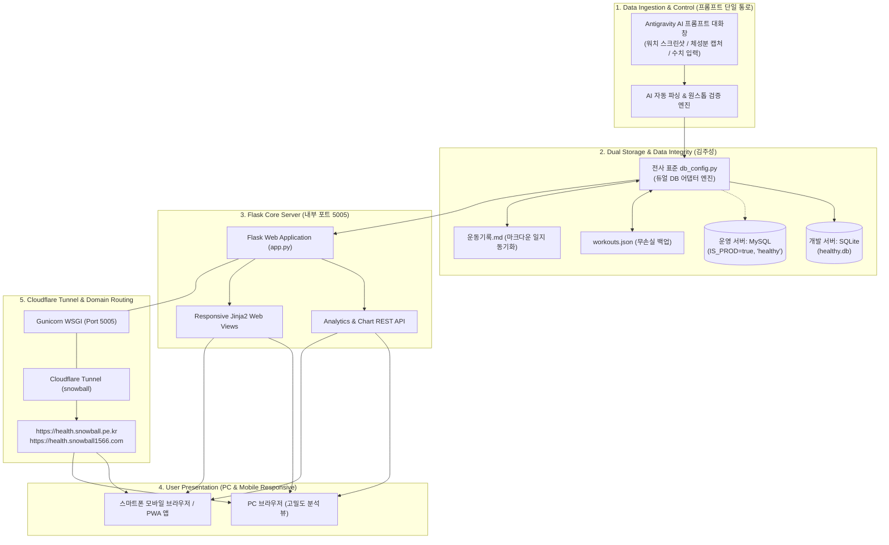

# 📋 개인 맞춤형 정밀 헬스케어 시스템 개발계획서
### Project: 바람길 (Baramgil - Precision Health Engine)

> **공식 관리 공간**: `utils/healthy/` (개발4팀 공식 시스템 디렉토리)  
> **주관 부서**: 개발4팀 (유틸리티 & 헬스케어 엔지니어링)  
> **총괄 PM**: [손현호] 차장 | **임상 자문 & 코칭**: [임선우] 수석 튜터  
> **자동화 파이프라인**: [박새찬] 스탭 | **플랫폼 & UI 아키텍처**: [김주성] 스탭  
> **문서 버전**: v1.10 (2026-10-06 현업 인터뷰 및 공식 명칭 '바람길' 확정)  
> **최종 승인권자**: **매니저님 (현업 총괄)**

---

## 1. 프로젝트 개요 (Executive Summary)

### 1.1 배경 및 목적
매니저님(1981년생, 신장 181~182cm, 체중 78kg 내외)은 수년 전 뇌종양 완치 이력과 가족력상 신부전증 선제 예방 관리가 요구되는 특수 임상 환경을 가지고 계십니다. 최근 3주간(2026.09.14 ~ 10.05) 총 18일, 36개 세션(112.2km, 9,309 kcal)에 달하는 방대한 일상 운동 데이터와 체성분 및 정기 피검사 데이터가 성공적으로 축적되었습니다.

본 프로젝트는 수작업/반자동으로 처리되던 **[운동 스크린샷 ➔ OCR 파싱 ➔ JSON/MD 수기 기록 ➔ 임상 코칭]**의 과정을 고도화하여, 현업 사용자의 개입을 최소화(Zero-Friction)하고 정밀한 데이터 기반 시계열 분석 및 임상 통찰을 제공하는 **전사 표준 웹 기반 헬스케어 관제 시스템 「바람길」 (Baramgil)**을 구축하는 것을 목적으로 합니다.

### 1.2 핵심 관리 지표 및 임상 철학
1. **무결점 선제 신장 보호 (Renal Safety Gate)**: 오버트레이닝(시간 > 75분, 칼로리 > 600 kcal, 고도 > 100m) 발생 시 자동 감지 및 요산(7.81 mg/dL) 농축 방지 미온수 보충.
2. **골격근 35.0kg 린매스 사수선 (Lean Mass Shield)**: 발한량(대용량 땀 배출)에 따른 체수분 저하 BIA 측정 오차를 역산하여 실질 근손실 여부를 정밀 판정.
3. **심폐 및 미토콘드리아 Zone 2 대사 최적화 (FatMax Focus)**: 심장과 관절에 무리 없는 105~125 BPM 구간 점유율 75%+ 유지.
4. **분기별 내분비내과 피검사 연동 (Clinical KPI Tracking)**: 당화혈색소 5.5% 이하, 중성지방 120 mg/dL 이하, 요산 6.50 mg/dL 이하 목표 달성 지원.

---

## 2. 현업 인터뷰 결과 및 설계 원칙 (Voice of Customer)

2026년 10월 06일 현업 담당자(매니저님)와의 심층 인터뷰를 통해 도출된 핵심 설계 원칙 및 시스템 요구사항입니다:

| 영역 | 현업 요구사항 (As-Is / 인터뷰 합의) | 시스템 반영 방안 (To-Be 아키텍처) |
| :--- | :--- | :--- |
| **데이터 입력** | • "데이터 등록은 지금처럼 프롬프트를 이용해서 별도로 입력하는 게 편함"<br>• "운동기록 캡처를 AI를 통해 등록하면 자동 반영, 조정 필요시 사후 대화" | • **Antigravity 프롬프트 단일 접점 유지**: 별도 백그라운드 파일 감지 데몬을 제거하여 시스템 경량화.<br>• **원스톱 자동 반영**: 캡처 전달 시 AI가 파싱하여 DB에 즉시 저장 후, 필요시 사후 대화로 보정. |
| **시스템 범위** | • "입력된 데이터를 잘 보여주는 방식으로 구성, 데이터 수정 등의 기능은 불필요" | • **순수 조회·관제 대시보드(Read-Only Analytics)**: 복잡한 웹 CRUD 폼을 배제하고 초경량 고속 렌더링에 100% 집중. |
| **시각화 & 필터** | • "과다 운동을 강조(경고 배너 등)할 필요는 없음"<br>• "기간(7일/30일/전체) 및 종목(전체/자전거/걷기) 필터링 상호 전환 필요" | • **담담하고 객관적인 데이터 흐름 표출**: 자극적 경고색 배제.<br>• 상단/사이드바에 **기간 × 종목 다차원 토글 필터** 장착. |
| **피검사 시각화** | • "검사 지표별 시계열 추이 그래프 + 목표선(Target Line) 표시" | • 당화혈색소(5.5%), 중성지방(120), 요산(6.50)의 **기준 목표선이 포함된 시계열 꺾은선 차트** 구현. |
| **기술 스택** | • "지금 다른 시스템은 모두 파이썬 플라스크(Flask)를 기반으로 하고 있는데" | • **Python Flask + Jinja2 + Chart.js (전사 표준 통일)**: Streamlit 대신 사내 표준 아키텍처 완벽 승계. |
| **모바일 & 인프라** | • "현재 서비스 중인 snowball.pe.kr과 snowball1566.com으로 접속할 필요가 있음"<br>• "풀어봄 시스템(5004)도 있음" | • **전사 서비스 5호 배정**: 내부 포트 **`5005`** 할당.<br>• **Cloudflare Tunnel 연동**: `https://health.snowball.pe.kr` (및 `health.snowball1566.com`) 연계.<br>• **모바일 반응형 + PWA**: 스마트폰 홈 화면 추가로 전용 헬스앱 경험 제공. |

---

## 3. 시스템 아키텍처 (System Architecture)



---

## 4. 전사 서비스 포트 및 도메인 매핑 (Infrastructure Topology)

「바람길」 시스템은 전사 서비스 표준 인프라 가이드(`server_migration_guide.md`)에 따라 5번째 공식 서비스로 정식 편입됩니다.

| 서비스명 | 대상 디렉토리 | 주관 부서 | 내부 포트 | 구동 방식 | 외부 서비스 도메인 (`Cloudflare Tunnel`) |
| :--- | :--- | :---: | :---: | :---: | :--- |
| **trade** | `trade/` | 개발2팀 | `5000` | Gunicorn | `https://trade.snowball1566.com` |
| **snowball** | `snowball/` | 개발1팀 | `5001` | Gunicorn | `https://snowball.pe.kr` (대표 메인) |
| **infosd** | `infosd/` | 개발3팀 | `5003` | Gunicorn | `https://infosd.snowball1566.com` |
| **cbt** (풀어봄) | `utils/cbt_engine/` | **개발4팀** | `5004` | Python/Gunicorn | `https://cbt.snowball.pe.kr` / `cbt.snowball1566.com` |
| 🍃 **healthy** (**바람길**) | `utils/healthy/` | **개발4팀** | **`5005`** | **Flask / Gunicorn** | **`https://health.snowball.pe.kr` / `health.snowball1566.com`** |

---

## 5. 상세 모듈 설계 (Module Specifications)

### 5.1 모듈 1: 프롬프트 수집 및 자동 동기화 (Data Ingestion & Mirroring)
* **담당자**: [박새찬], [손현호]
* **핵심 정책**:
  1. **Zero-Friction 단일 접점**: 별도의 업로드 웹 폼이나 로컬 폴더 감지 데몬을 배제하고, Antigravity IDE 프롬프트에 이미지/수치를 전달하면 1초 내 자동 파싱.
  2. **원스톱 무손실 저장**: 파싱된 데이터는 `healthy.db`에 INSERT됨과 동시에 기존 `workouts.json` 및 `운동기록.md`에도 자동으로 동기화 미러링(Mirroring).
  3. **사후 대화 보정**: 오인식 또는 매니저님의 수치 조정 요청 시 "10월 6일 심박수 128로 수정해줘" 등의 대화로 즉시 업데이트.

### 5.2 모듈 2: 데이터 계층 (전사 표준 듀얼 DB: Dev SQLite ➔ Prod MySQL)
* **담당자**: [김주성]
* **핵심 아키텍처**:
  * 전사 표준 패턴(`db_config.py`)에 따라 환경변수 `IS_PROD`에 의해 자동 분기:
    - 로컬 개발 환경: 경량 무설치 SQLite 파일 (`utils/healthy/healthy.db`)
    - 클라우드 운영 환경: MySQL (`healthy` 전용 스키마)
* **표준 DDL 스키마**:
  ```sql
  -- 1. 일별 운동 마스터 테이블
  CREATE TABLE IF NOT EXISTS workouts (
      id INTEGER PRIMARY KEY AUTOINCREMENT,
      workout_date DATE NOT NULL UNIQUE,
      day_of_week VARCHAR(10) NOT NULL,
      time_of_day VARCHAR(20),
      workout_type VARCHAR(100),
      routine_name VARCHAR(150),
      morning_fasting_blood_sugar INTEGER NULL,
      evaluation VARCHAR(100) NOT NULL,
      notes TEXT,
      created_at TIMESTAMP DEFAULT CURRENT_TIMESTAMP
  );

  -- 2. 세부 세션 테이블
  CREATE TABLE IF NOT EXISTS workout_sessions (
      id INTEGER PRIMARY KEY AUTOINCREMENT,
      workout_id INTEGER NOT NULL,
      session_no INTEGER NOT NULL,
      sport_type VARCHAR(50) NOT NULL,
      session_name VARCHAR(100),
      duration_seconds INTEGER NOT NULL,
      duration_str VARCHAR(20),
      distance_km REAL DEFAULT 0.00,
      active_kcal INTEGER NOT NULL,
      total_kcal INTEGER NOT NULL,
      elevation_gain_m INTEGER DEFAULT 0,
      avg_heart_rate_bpm INTEGER,
      max_heart_rate_bpm INTEGER,
      avg_speed_kmh REAL,
      avg_pace VARCHAR(20),
      effort VARCHAR(50),
      weather_info TEXT,
      notes TEXT,
      FOREIGN KEY (workout_id) REFERENCES workouts(id) ON DELETE CASCADE
  );

  -- 3. 구간별 스플릿 테이블
  CREATE TABLE IF NOT EXISTS session_splits (
      id INTEGER PRIMARY KEY AUTOINCREMENT,
      session_id INTEGER NOT NULL,
      split_no INTEGER NOT NULL,
      distance_km REAL,
      time_str VARCHAR(20),
      speed_kmh REAL,
      heart_rate_bpm INTEGER,
      FOREIGN KEY (session_id) REFERENCES workout_sessions(id) ON DELETE CASCADE
  );

  -- 4. 샤워 직후 체성분 추적 테이블
  CREATE TABLE IF NOT EXISTS body_composition (
      id INTEGER PRIMARY KEY AUTOINCREMENT,
      measure_date DATE NOT NULL UNIQUE,
      weight_kg REAL NOT NULL,
      body_fat_pct REAL NOT NULL,
      skeletal_muscle_kg REAL NOT NULL,
      bmi REAL NOT NULL,
      is_dehydrated INTEGER DEFAULT 0,
      notes TEXT,
      created_at TIMESTAMP DEFAULT CURRENT_TIMESTAMP
  );

  -- 5. 분기별 정기 피검사(내분비내과) 시계열 테이블
  CREATE TABLE IF NOT EXISTS clinical_lab_results (
      id INTEGER PRIMARY KEY AUTOINCREMENT,
      exam_date DATE NOT NULL UNIQUE,
      hba1c_pct REAL NOT NULL,
      fasting_glucose INTEGER,
      triglyceride_mgdl INTEGER,
      ldl_mgdl INTEGER,
      uric_acid_mgdl REAL NOT NULL,
      ast_u_l INTEGER,
      alt_u_l INTEGER,
      creatinine_mgdl REAL,
      egfr_score REAL,
      notes TEXT,
      created_at TIMESTAMP DEFAULT CURRENT_TIMESTAMP
  );
  ```

### 5.3 모듈 3: Flask 기반 반응형 관제 대시보드 (Read-Only Visualization)
* **담당자**: [김주성], [손현호]
* **핵심 원칙**: 입력/수정 기능을 배제한 **순수 고도화 조회·분석 뷰**.
* **화면 정보 구조 (UI Layout)**:
  1. **상단 KPI 헤더 카드**:
     - 최근 체중 및 골격근량(35.0kg 사수선 대비 상태)
     - 이번 주 누적 거리(km) 및 총 소모 칼로리(kcal)
     - 다음 분기 피검사 D-Day 카운트다운
  2. **필터 컨트롤러 바 (상단/사이드바)**:
     - **기간 선택 버튼**: `[최근 7일]` / `[최근 30일]` / `[전체 기간]` (원클릭 토글)
     - **종목 선택 버튼**: `[전체]` / `[자전거]` / `[걷기]`
  3. **운동 및 체성분 메인 시계열 차트 (Chart.js / Plotly)**:
     - 체중 vs 골격근량 듀얼 축 트렌드 (35.0kg 기준선 오버레이)
     - 일자별 운동 칼로리 및 심박수 Zone 2 점유율 바/라인 복합 차트
  4. **정기 혈액검사(내분비내과) 목표 추이 섹션**:
     - **당화혈색소 (HbA1c)**: 6.1% ➔ 5.7% 추이선 + `목표: 5.5% 이하` 기준선
     - **중성지방 (TG)**: 217 ➔ 157 mg/dL 추이선 + `목표: 120 이하` 기준선
     - **요산 (Uric Acid)**: 7.30 ➔ 7.81 mg/dL 추이선 + `목표: 6.50 이하` 기준선
     - **LDL 콜레스테롤**: 105 ➔ 74 mg/dL 추이선 + `유지선: 70~80`
  5. **모바일 최적화 (Mobile-Responsive & PWA)**:
     - 모바일 화면 접속 시 1열 카드로 자동 스택 재정렬 및 터치 툴팁 지원
     - Web App Manifest(`manifest.json`) 적용으로 스마트폰 '홈 화면에 추가' 시 앱 아이콘 생성

---

## 6. 단계별 개발 로드맵 (Milestones & Roadmap)

| 단계 | 기간 / 일정 | 주요 목표 및 세부 산출물 | 완료 기준 |
| :---: | :---: | :--- | :--- |
| **Phase 1<br>(기반 구축 & 마이그레이션)** | 즉시 착수 (1~2일) | • **개발 서버용 `healthy.db` (SQLite) 생성 및 전사 표준 `db_config.py` 듀얼 어댑터 구현**<br>• 기존 18일간의 `workouts.json` 및 `혈액수치.xlsx` 데이터 ➔ `healthy.db` 무손실 마이그레이터(`migrate_data.py`) 실행<br>• DB ↔ JSON/MD 양방향 동기화 검증 | SQLite 테이블 생성 완료, 과거 누적 18일 36개 세션 데이터 정합성 100% 일치 |
| **Phase 2<br>(Flask 대시보드 구축)** | 2~3일차 | • **Flask 웹 애플리케이션 (`utils/healthy/app.py`, Port 5005) 개발**<br>• Jinja2 템플릿 및 Chart.js 기반 인터랙티브 차트(체성분, 운동부하, 피검사 목표선) 연동<br>• 기간(7일/30일/전체) 및 종목(자전거/걷기) 필터 컨트롤러 완성<br>• 모바일 반응형 CSS 미디어 쿼리 적용 | 브라우저(`localhost:5005`)에서 모든 차트 및 필터 정상 작동 |
| **Phase 3<br>(인프라 연동 & 모바일 배포)** | 4~5일차 | • `cbt_start.sh` 스타일의 원클릭 데몬 런처(`healthy_start.sh`) 제작<br>• Cloudflare Tunnel 인그레스 라우팅 등록 (`health.snowball.pe.kr` / `health.snowball1566.com`)<br>• PWA 매니페스트 및 모바일 홈 화면 바로가기 테스트<br>• Antigravity AI 프롬프트 원스톱 입력 파서 최종 연동 | 외부 모바일 환경에서 도메인 접속 성공 및 프롬프트 1초 자동 반영 검증 |

---

## 7. 품질 관리 및 운영 원칙 (Quality & Principles)

1. **원천 데이터 100% 보존 (Data Immutability)**:
   - 신규 DB 가동 후에도 기존 `workouts.json`과 `운동기록.md`는 항상 최신 상태로 미러링(Mirroring)되어 데이터 유실 위험 0% 유지.
2. **사내 표준 통일성 (Consistency)**:
   - 기술 스택(Python Flask), 데이터베이스 어댑터(`db_config.py`), 포트 관리(`5005`), 배포 방식(Gunicorn + Cloudflare) 전반에 걸쳐 기존 사내 시스템(Snowball, CBT, InfoSD)의 표준을 철저히 준수.
3. **사용자 제어권 및 변경 통제**:
   - 모든 커밋 및 배포는 매니저님의 명시적 승인 하에 진행하며, 코드 내 파일 경로는 `pathlib.Path`를 사용하여 OS 독립성을 보장.

---

> **승인 및 배포**:  
> • 총괄 PM: 개발4팀 차장 [손현호]  
> • 플랫폼 & UI 아키텍트: 개발4팀 스탭 [김주성]  
> • 임상 자문 & 코칭: 개발4팀 수석 튜터 [임선우]  
> • 자동화 엔지니어: 개발4팀 스탭 [박새찬]  
> • **최종 승인권자**: **매니저님**
